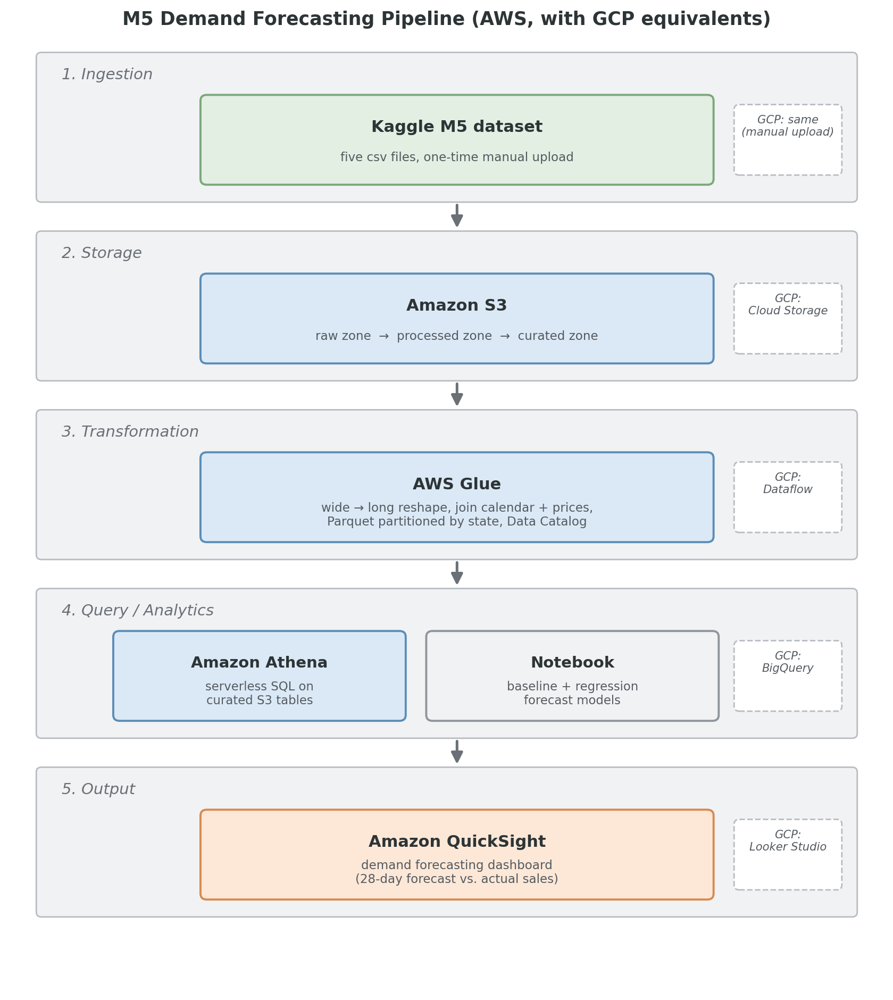

# Walmart M5 Demand Forecasting on AWS

MGMT 599 · Group 5 · Jaewon Jang, Jason Tofte, Ross Roach

A serverless cloud analytics pipeline that turns the Walmart M5 retail dataset
into a 28-day demand forecast and an inventory-planning dashboard.

---

## The problem

A store inventory manager has to decide how much of each product to stock. Too
much ties up money in shelf space that could be spent elsewhere; too little means
lost sales. Both errors are expensive, and the manager makes this decision across
thousands of products at once.

This project forecasts daily unit demand so those decisions can be made against a
projection rather than a guess. The intended user is whoever sets store-level
stock levels.

## The data

[M5 Forecasting Accuracy](https://www.kaggle.com/competitions/m5-forecasting-accuracy)
(Kaggle), contributed by Walmart. Five CSV files covering **3,049 products across
10 stores in 3 states** (CA, TX, WI) over **1,941 days**.

| File | Contents |
|---|---|
| `sales_train_evaluation.csv` | 30,490 item-store series, one column per day (`d_1`…`d_1941`) |
| `calendar.csv` | 1,969 dates with holidays, events, and SNAP benefit days |
| `sell_prices.csv` | Weekly price per item, per store |
| `sales_train_validation.csv` | Same as evaluation, truncated at `d_1913` |
| `sample_submission.csv` | Competition format, unused here |

**Important:** the `d_` columns record **units sold** on that day, not on-hand
inventory. Roughly two thirds of item-days are zero, which is normal for
slow-moving SKUs.

Raw data is **not committed to this repo** (400+ MB). Download it from Kaggle and
point the upload script at the folder.

## Architecture



| Layer | AWS | GCP equivalent |
|---|---|---|
| Ingestion | CLI upload to S3 | Same (manual) |
| Storage | S3, zoned: raw / processed / curated | Cloud Storage |
| Transformation | Local pandas transform + Athena CTAS (Glue Spark job as optional evidence) | Dataflow |
| Catalog | Glue crawler + Glue Data Catalog | Dataproc Metastore |
| Query & analytics | Athena + Jupyter notebook | BigQuery |
| Output | QuickSight dashboard | Looker Studio |

Ingestion is a one-time manual upload rather than a streaming service, because
the dataset is fixed and never updates. Adding Kinesis here would be complexity
without benefit.

## Setup

**Prerequisites:** an AWS account, AWS CLI configured, Python 3.9+, and the M5
CSVs downloaded from Kaggle.

```bash
# 1. Create the bucket, zones, and upload the raw data
./scripts/upload_to_s3.sh /path/to/m5-forecasting-accuracy

# 2. Prove the transform locally on one store first (fast, ~30 seconds).
#    Do this before touching Glue, whose cold starts take 2-3 minutes per run.
python scripts/transform_local.py \
    --data-dir /path/to/m5-forecasting-accuracy \
    --out ./data/processed \
    --stores CA_1
```

**3. Run the full transform locally and upload.** Repeat step 2 with
`--by-store` instead of `--stores CA_1` to process all ten stores, then upload:

```bash
aws s3 cp ./data/processed s3://<bucket>/processed/sales_long/ --recursive
```

The transform runs locally rather than in Glue because it is a wide-to-long melt
of a 120 MB CSV, a workload a laptop finishes in about a minute. Glue's setup
cost is the same regardless of data size and it is the highest-failure-rate step
in the build, so keeping it off the critical path removes the risk without
removing the layer.

**3b. (Optional) Run the same transform in Glue as evidence.** Create a Spark job
from `scripts/glue_job.py` with worker type G.1X, 3 workers, and job parameters
`--S3_BUCKET` and `--SALES_FILE`. It writes to `processed/sales_long_glue/`, a
separate prefix, so a failed run cannot damage the working data. Nothing
downstream depends on this step.

**4. Catalog the output.** Point a Glue crawler at
`s3://<bucket>/processed/sales_long/` targeting database `m5_db`. Confirm
`state_id` is detected as a **partition key**, not a regular column.

**5. Set the Athena query result location** to `s3://<bucket>/athena-results/`
under Athena → Settings. Athena will not run a single query until this is set.

**6. Run the SQL in order.** `sql/01_validation_rowcounts.sql` comes first:
if the row counts are wrong, everything downstream is wrong.

**7. Run the notebook.** `notebooks/02_forecasting_models.ipynb` pulls from
Athena, fits the models, and writes predictions back to S3.

**8. Build the dashboard.** In QuickSight, grant S3 and Athena access under
*Manage QuickSight → Security & permissions*. This is separate from your IAM
role and is the usual reason Athena tables do not appear.

## Repository map

```
architecture/     Pipeline diagram
scripts/          upload_to_s3.sh, transform_local.py, glue_job.py
sql/              Numbered Athena queries, run in order
notebooks/        EDA and forecasting models
screenshots/      Implementation evidence
docs/             Proposal, checkpoint, final report
```

### SQL files

| File | Purpose |
|---|---|
| `00_setup_database.sql` | Create `m5_db`, verify the crawler output |
| `01_validation_rowcounts.sql` | **Run first.** Row counts, PK uniqueness |
| `02_sales_by_category_store.sql` | Volume by category and store |
| `03_price_vs_demand.sql` | Does price move demand? |
| `04_snap_day_effect.sql` | SNAP benefit-day lift |
| `05_event_day_effect.sql` | Holiday and weekday seasonality |
| `06_data_quality_checks.sql` | Intermittency, nulls, outliers, lifecycle |
| `07_curated_daily_agg.sql` | Build the serving tables for QuickSight |
| `08_forecast_vs_actual.sql` | Register model output, score the models |

## Data model

One fact table at **item × store × day** grain: 59,181,090 rows, Snappy Parquet,
partitioned by `state_id`.

- **Primary key:** `(item_id, store_id, d)`
- **Calendar join:** `sales_long.d = calendar.d`
- **Price join:** `(store_id, item_id, wm_yr_wk)`, LEFT. Nulls are real signal,
  meaning the item was not yet carried in that store

Partitioning is by state only, deliberately, and worth stating accurately.
Most of our analytical queries aggregate across all three states, so partition
pruning is not the main saving at this data size. The Athena cost reduction comes
primarily from columnar projection plus Snappy compression: a query reading four
of the sixteen columns scans only those four. Partitioning helps the
state-filtered queries and demonstrates the technique correctly. With under a
gigabyte of Parquet total, a second partition level would create small-file
overhead costing more than it saves.

Curated tables (`daily_sales_agg`, `weekly_item_agg`, `forecast_vs_actual`) exist
so the dashboard never scans the 59M-row fact table.

## Results

Scored on a common 28-day holdout, FOODS in California (5,748 item-store series,
160,944 rows per model). Metrics computed in Athena against `forecast_vs_actual`.

| Model | RMSE | MAE | Bias |
|---|---|---|---|
| Gradient boosting | 2.6635 | 1.4674 | -0.0634 |
| Weekday mean | 3.1034 | 1.5828 | -0.3644 |
| Seasonal naive (28d) | 3.3399 | 1.7487 | -0.0855 |
| Naive (last value) | 3.5710 | 1.9421 | +0.4660 |

Key findings:

1. Demand is highly intermittent. 68.0% of item-days have zero sales overall,
   ranging from 61.8% in FOODS to 77.1% in HOBBIES. This is normal for
   item-level retail rather than a data defect, and it is the main constraint on
   model choice: a model scored on RMSE alone is rewarded for predicting near
   zero everywhere, so we report MAE and bias alongside it.
2. Day of week is the dominant pattern. The seasonal naive baseline captures the
   weekly shape well enough to beat the last-value baseline by 4.5% on RMSE.
3. SNAP benefit days lift FOODS demand by 30.0% in WI, 15.6% in TX and 10.2% in
   CA. HOBBIES moves 1.8-3.0% on the same days. The effect being concentrated in
   the category that SNAP benefits actually apply to is evidence the signal is
   real rather than an artifact of the join.
4. Gradient boosting wins on all three metrics at once: RMSE 2.6635 against the
   best baseline's 3.1034, a 20.3% improvement. It also has the smallest bias at
   -0.06 units per day.
5. Only the last-value baseline over-forecasts (+0.47 units per day). The other
   three under-forecast, with weekday mean worst at -0.36. That direction
   matters more than its size suggests, since a stockout costs more than the
   equivalent unit of excess stock.

Data quality checks against the full 59.2M-row table: row count matches the
expected 59,181,090 exactly, 30,490 distinct item-store series as expected, zero
negative unit values, 68.0% zero-sales item-days and 20.78% null `sell_price`.
The last two are reported as informational rather than failures.

## Interpreting the output

The dashboard shows historical daily units and a 28-day forecast, filterable by
state, store, and category. An inventory manager compares the forecast total for
the coming four weeks against current stock to decide whether to order.

Read **bias** alongside RMSE. A model that is accurate on average but
systematically under-forecasts is worse than its RMSE suggests, because a
stockout costs more than the equivalent excess inventory.

## Cost and cleanup

Total project cost: under $10, tracked against a budget alert set before any
resource was created.

- $10 AWS budget alert with an 80% threshold, configured before the first upload
- Parquet with Snappy compression, cutting Athena scan volume by roughly 90%
- Partitioning so state-filtered queries skip roughly two thirds of the data
- Curated aggregates so the dashboard queries 135,870 rows rather than 59.2M
- Athena query results written to a dedicated zone rather than a default location
- SageMaker notebook instance stopped when not in use

Athena is not the cost risk here, since compression keeps scanned volume
trivial. The real risks are idle resources: a running notebook instance and an
uncancelled dashboard subscription, both of which bill whether or not anyone is
using them. `docs/TEARDOWN.md` lists every resource this project created and the
order to remove them in.

## Generative AI use

Generative AI was used for drafting documentation, debugging errors, and
structuring the architecture diagram. Every statistic in this repository and in
the report comes from our own queries run against our own data in our own AWS
account. Model results were computed in Athena from the registered
`forecast_vs_actual` table and can be reproduced from `sql/` by anyone with
access to the bucket.
